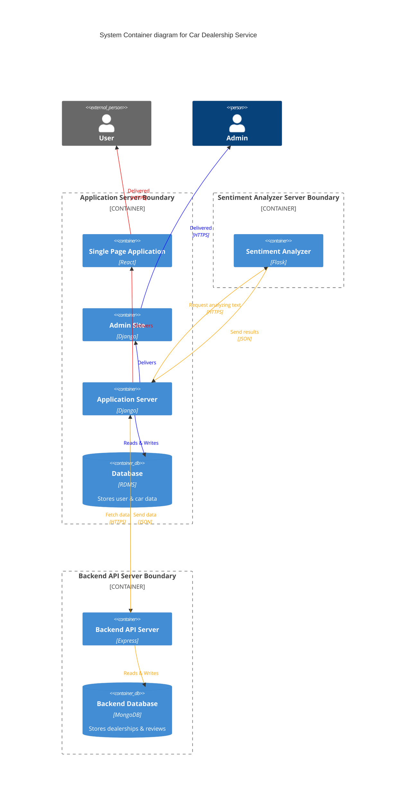

# IBM Full Stack Developer Capstone Project

Final Project for the Coursera Course:

- Program: IBM Full Stack Software Developer Professional Certificate
- Course: [Full Stack Application Development Capstone Project](https://www.coursera.org/learn/ibm-cloud-native-full-stack-development-capstone?specialization=ibm-full-stack-cloud-developer)

## Getting Started

```bash
cd server

pip install -r requirements.txt

python3 manage.py makemigrations
python3 manage.py migrate

python3 manage.py runserver
```

## Tech Stack

- Django
- React
- Express
- MongoDB
- Flask
- Docker
- Kubernetes

## Packages

- `/server`: Application Server
- `/server/frontend`: Static Pages & SPA [more](./server/frontend)
- `/server/database`: Backend API Server [more](./server/database)
- `/server/djangoapp/microservices`: Sentiment Analyzer [more](./server/djangoapp/microservices)

## Features

- User login and registration
- View the list of dealership
- Filter the list of dealership by state
- View the dealership details
- Submit and view reviews for dealerships
- Admin panel for car management

## System Architecture


